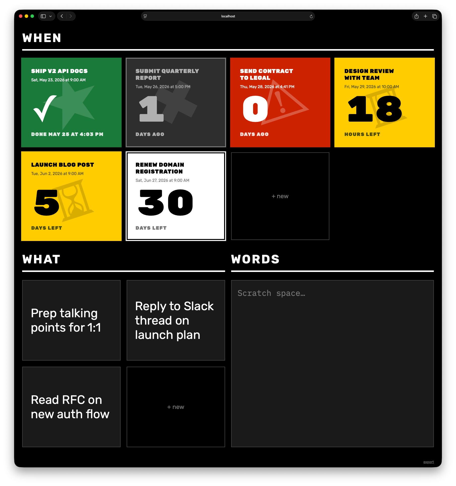

# Deadline Dashboard

A place to organize top-of-mind projects and upcoming due dates.

With DD, you can set deadlines to show how many days before the due date, and create cards that describe the big things. Finally, a scratch area to take notes.

This is not meant for task breakdowns or managing projects. No notifications. No details. Just big words.



## Running

Open `index.html` in your browser. That's it — no build step, no server required.

Or serve it locally:

```sh
python3 -m http.server 8080
```

## Data and sync

All data lives in your browser's localStorage. There is no cloud sync, no accounts, no server-side storage. Your deadlines, Now cards, and scratch notes never leave your machine.

## Export / Import

Click "export" in the bottom-right corner. This encodes all your data (deadlines, Now cards, and today notes) into a URL with a base64 hash fragment. Copy the URL and open it in another browser to import everything. The import is a one-time snapshot — changes made afterward are independent in each browser.

## Features

- Countdown cards with urgency-based color coding (red/yellow/white)
- Mark deadlines as done (green card with completion timestamp)
- "Now" cards for what's top of mind
- Scratch space for daily notes
- Drag to reorder
- Natural language date parsing ("next friday", "next week", "june 15 9am")
- Export/import via URL for moving between browsers
